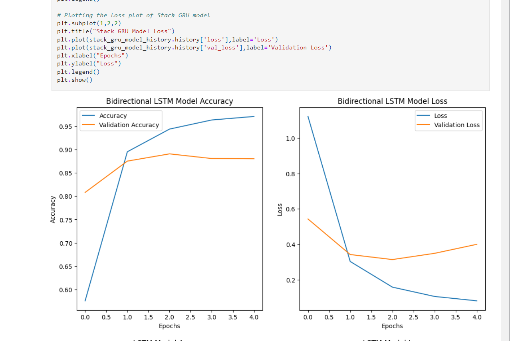
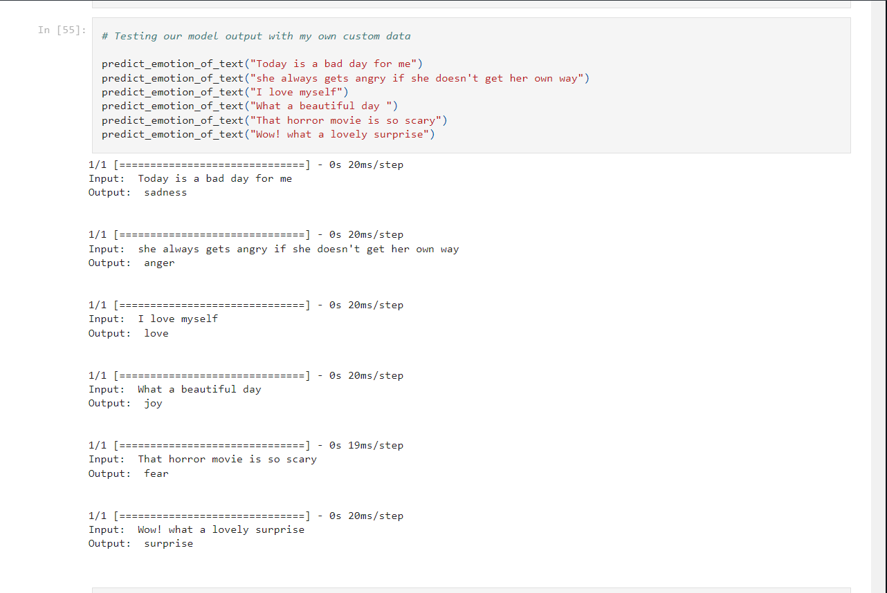

# Emotion Detection for Text using LSTM

Emotion Detection for Text using LSTM is a deep learning project that focuses on analyzing the sentiment of text data and categorizing it into different emotional categories such as sadness, joy, love, anger, fear, and surprise using Long Short-Term Memory (LSTM) networks.

## Table of Contents

- [Introduction](#introduction)
- [Technologies/Tools Used](#technologies-tools-used)
- [Description](#description)
- [Installation](#installation)
- [Usage](#usage)
- [Screenshots](#screenshots)
- [Dataset](#dataset)
- [Contributing](#contributing)
- [License](#license)

## Introduction

Emotion Detection for Text using LSTM leverages deep learning techniques, specifically Long Short-Term Memory (LSTM) networks, to analyze the sentiment of textual data. By training LSTM models on labeled text data, this project aims to accurately detect the emotional content of text data.

## Technologies/Tools Used

- Python
- TensorFlow
- Keras
- NLTK
- Jupyter Notebook

## Description

The project preprocesses text data by tokenizing, removing stopwords, and stemming the words to enhance the accuracy of emotion detection. It then utilizes LSTM (Long Short-Term Memory) networks, a type of recurrent neural network (RNN), to classify the text into predefined emotional categories. The model is trained on labeled text data to learn the patterns associated with each emotion.

## Installation

1. Clone the repository:

    ```bash
    git clone https://github.com/your_username/emotion-detection-text-lstm.git
    ```

2. Install dependencies:

    ```bash
    pip install -r requirements.txt
    ```

## Usage

1. Open the Jupyter Notebook:

    ```bash
    jupyter notebook emotion_detection_text_lstm.ipynb
    ```

2. Follow the instructions in the notebook to execute the code and analyze the sentiment of text data.

## Screenshots




<!-- Add more screenshots as needed -->

## Dataset

The dataset used for training the LSTM model can be found in the notebook.

## Contributing

Contributions are welcome! Please fork the repository and create a pull request with your proposed changes.

## License

This project is licensed under the [MIT License](LICENSE).

